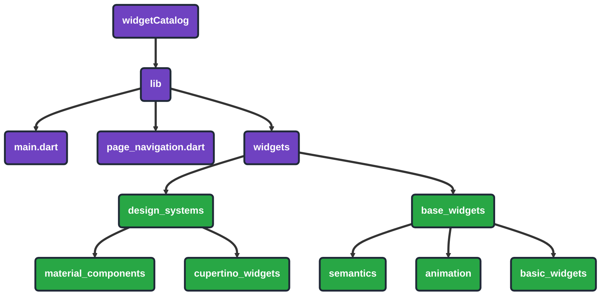

# Flutter Widget Catalog Project

<a id="readme-top"></a>

Welcome to Flutter Widget Catalog! This app showcases a curated catalog of Flutter widgets with focused, runnable demos for both Material and Cupertino design systems, plus core/base widgets. It’s designed as a learning reference to explore widget usage, properties, accessibility, and animations in a clean, browsable format.

## Table of Contents

- [Installation](#installation)
- [Usage](#usage)
- [Features](#features)
- [Project Structure](#project-structure)
- [Contributing](#contributing)
- [Built With](#built-with)
- [Top Contributors](#top-contributors)
- [Support the Project](#support-the-project)
- [Contact](#contact)

## Installation

To get started with this project, follow these steps:

1. **Clone the repository**
   ```bash
   git clone https://github.com/your-username/mahmoudbakir_week2_widgetcatalog.git
   cd mahmoudbakir_week2_widgetcatalog
   ```

2. **Install dependencies**
   ```bash
   flutter pub get
   ```

3. **Run the application**
   ```bash
   flutter run
   ```

## Usage

- Launch the app and browse pages using the bottom page controls.
- Each page demonstrates a specific widget with minimal code, labels, and styling for clarity.
- Pages are grouped by category: Design Systems (Material/Cupertino) and Base Widgets (Semantics, Animation, Basic Widgets, etc.).

## Features

- ✅ **Widget Demos**: Clear, focused examples for many Flutter widgets
- ✅ **Material & Cupertino**: Side-by-side design system samples
- ✅ **Navigation**: Simple paged navigation with indicator and arrows
- ✅ **Accessibility**: `Semantics` examples with labels and actions
- ✅ **Animations**: `AnimatedModalBarrier`, `AnimatedPhysicalModel`, `PositionedTransition`, `RelativePositionedTransition`
- ✅ **Basic Widgets**: e.g., `Placeholder` usage and customization
- ✅ **Consistent Styling**: Carded pages with titles and centered demos

## Project Structure



This diagram illustrates the high-level layout of the widget catalog: a simple `lib` entry point with a `PageView`-driven navigator and grouped widget demo pages under `widgets/`.

## Contributing

We welcome contributions to this project! Here's how you can help:

1. **Fork the repository**
2. **Create a feature branch** (`git checkout -b feature/contributer-feature`)
3. **Commit your changes** (`git commit -m 'Add some contributer feature'`)
4. **Push to the branch** (`git push origin feature/contributer-feature`)
5. **Open a Pull Request**

### Development Guidelines

- Keep examples minimal and focused on a single widget concept
- Prefer clear naming and consistent page styling
- Update documentation when adding new demo pages
- Follow the existing code style

## Built With

This project is built with:

-  

### Top contributors:

<a href="https://github.com/Mahm0udbakir/mahmoudbakir_week2_widgetcatalog/graphs/contributors">
  
  </a>

## Support the Project

If you find this project helpful, consider supporting it:

[](https://buymeacoffee.com/mahmoudbakir)

## Contact

- **Author**: Mahmoud Bakir
- **Email**: [mahmoud.m.bakir@gmail.com](mailto:mahmoud.m.bakir@gmail.com)
- **GitHub**: [@Mahm0udbakir](https://github.com/Mahm0udbakir)
- **LinkedIn**: [Mahmoud Bakir](https://www.linkedin.com/in/mahm0udbakir/)

<p align="right">(<a href="#readme-top">back to top</a>)</p>
